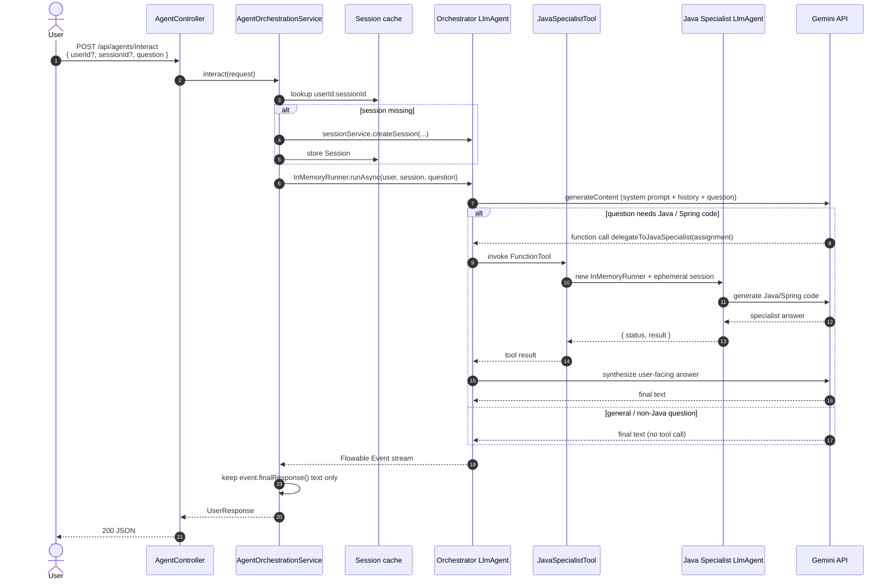

# Multi-Agent AI Workflow (Spring Boot + Google ADK)

Production-style Spring Boot 3 service that coordinates two Gemini-backed agents using [Google Agent Development Kit (ADK) for Java](https://adk.dev/get-started/java/) `0.5.0`:

| Agent | Role |
|---|---|
| **Primary Orchestrator** (`orchestrator_agent`) | Lead project manager. Analyzes the user question, delegates Java/Spring work, and synthesizes the final answer. |
| **Java Expert Support Agent** (`java_specialist_agent`) | Specialist code generator. Produces idiomatic Java 17 / Spring Boot 3 components from orchestrator assignments. |

The orchestrator never “guesses” Java implementations when code is required. It calls a native ADK **function tool** (`delegateToJavaSpecialist`), which programmatically runs the specialist agent and returns the specialist output as a tool result.

---

## Architecture

The app is a Spring MVC service. One HTTP call can trigger **one** Gemini hop (orchestrator only) or **two** hops (orchestrator → Java specialist → orchestrator synthesis).

### Logical components

```mermaid
flowchart TB
    subgraph Client
        P[Postman / curl / UI]
    end

    subgraph Spring["Spring Boot — com.ermahto.multiagent"]
        C[AgentController<br/>POST /api/agents/interact]
        S[AgentOrchestrationService]
        Cache[(ConcurrentHashMap<br/>userId:sessionId → ADK Session)]
        CFG[AgentConfig + AgentProperties]
        T[JavaSpecialistTool<br/>@Schema delegateToJavaSpecialist]
        E[GlobalExceptionHandler]
    end

    subgraph ADK["Google ADK 0.5.0"]
        OR[InMemoryRunner — orchestrator]
        OA[Orchestrator LlmAgent<br/>gemini-3.6-flash]
        FT[FunctionTool]
        SR[InMemoryRunner — specialist]
        JA[Java Specialist LlmAgent<br/>gemini-3.6-flash]
    end

    subgraph Gemini["Google AI Studio"]
        G[Gemini API]
    end

    P --> C --> S
    S --> Cache
    S --> OR --> OA
    CFG --> OA
    CFG --> JA
    CFG --> T
    OA --> FT --> T --> SR --> JA
    OA --> G
    JA --> G
    S --> C
    E -.-> C
```

| Layer | Class | Responsibility |
|---|---|---|
| API | `AgentController` | Accepts JSON, returns `{ userId, sessionId, answer }` |
| Orchestration | `AgentOrchestrationService` | Session cache, `runAsync`, assemble final tokens |
| Config | `AgentProperties` / `AgentConfig` | Prompts, model IDs, `Gemini.builder().apiKey(...)` beans |
| Tool | `JavaSpecialistTool` | Native ADK function the orchestrator can call |
| Errors | `GlobalExceptionHandler` | 400 validation, 502 ADK/Gemini failures |

### Request flow (end to end)



### Two runtime paths

**Path A — Orchestrator only** (for example: “What does a project manager do?”)

1. Controller validates `question`.
2. Service loads or creates an ADK session.
3. Orchestrator answers with Gemini.
4. No `delegateToJavaSpecialist` call.
5. HTTP `answer` is the orchestrator’s final text.

**Path B — Orchestrator + specialist** (for example: “Generate a Spring Boot REST controller…”)

1. Same session lookup as Path A.
2. Orchestrator decides the work is Java/Spring and emits a **function call**.
3. ADK runs `JavaSpecialistTool.delegateToJavaSpecialist(assignment)`.
4. The tool starts a **separate** specialist `InMemoryRunner` and session (not the user’s chat session).
5. Specialist returns code; the tool wraps it as `{ status, result }`.
6. Orchestrator reads the tool result and writes a clear final answer for the user.
7. HTTP `answer` is that synthesized text, not raw tool JSON.

Server log for Path B includes `Routing assignment to Java Specialist`.

### Session and conversation memory

```
First request (no IDs)
    → generate userId + sessionId
    → ADK createSession(appName, userId, sessionId)
    → cache key = "userId:sessionId"
    → response echoes the IDs

Follow-up (same IDs)
    → cache hit
    → same ADK session
    → orchestrator sees prior user/model turns
```

- **User chat history** lives on the **orchestrator** session (`userId` + `sessionId`).
- **Specialist runs** are one-shot. Each tool call gets a new specialist session so assignments stay isolated.
- Cache is **in-memory**. Restarting the JVM drops history.

### How ADK events become the HTTP answer

```
runner.runAsync(...)
    → RxJava Flowable<Event>
    → blockingForEach on the servlet thread
    → if event.finalResponse() == true
          append event.stringifyContent()
    → skip function-call / function-response events
    → return concatenated text as answer
```

That filter keeps tool-call internals out of the JSON `answer`.

### Startup wiring

`AgentConfig` builds beans in this order:

1. Resolve Gemini API key (`GOOGLE_API_KEY`, `GEMINI_API_KEY`, or `google.api-key`). Fail fast if missing.
2. `javaSpecialistAgent` = `LlmAgent` + `Gemini.builder().modelName(...).apiKey(...)`.
3. `JavaSpecialistTool` wrapping that agent’s `InMemoryRunner`.
4. `FunctionTool.create(tool, "delegateToJavaSpecialist")`.
5. `orchestratorAgent` = `LlmAgent` + same Gemini pattern + the function tool.
6. `orchestratorRunner` = `InMemoryRunner(orchestratorAgent)` injected into the service.

Prompts and model IDs come from `application.yml` → `AgentProperties` records.

### Design notes

- **Configuration** lives in `application.yml` and binds to immutable records via `@ConfigurationProperties`.
- **Gemini auth** is passed into `Gemini.builder().apiKey(...)`. The GenAI SDK does **not** read `System.setProperty("GOOGLE_API_KEY")`; the key must be in the process environment or `google.api-key`.
- **Reactive ADK output** is consumed with `blockingForEach`. Only `finalResponse()` tokens are returned.
- Failures from Gemini/ADK are unwrapped and returned as HTTP **502** with the root exception message.

---

## Project layout

```
src/main/java/com/ermahto/multiagent/
├── MultiAgentApplication.java
├── api/
│   ├── UserRequest.java
│   └── UserResponse.java
├── config/
│   ├── AgentProperties.java
│   └── AgentConfig.java
├── controller/
│   └── AgentController.java
├── exception/
│   ├── AgentOrchestrationException.java
│   └── GlobalExceptionHandler.java
├── service/
│   └── AgentOrchestrationService.java
└── tool/
    └── JavaSpecialistTool.java

src/main/resources/application.yml
pom.xml
```

---

## Prerequisites

| Requirement | Version / notes |
|---|---|
| JDK | **17 or higher** (enforced by Maven) |
| Maven | 3.8+ |
| Gemini API key | From [Google AI Studio](https://aistudio.google.com/apikey) |
| Network | Outbound HTTPS to Gemini |

This repo was verified with **Amazon Corretto 17.0.16** and Maven **3.8.6**.

---

## Setup

### 1. Point Maven at JDK 17

**Command Prompt**

```bat
set JAVA_HOME=C:\Software\Amazon Corretto\jdk17.0.16_8
set PATH=%JAVA_HOME%\bin;%PATH%
java -version
mvn -version
```

**PowerShell**

```powershell
$env:JAVA_HOME = "C:\Software\Amazon Corretto\jdk17.0.16_8"
$env:PATH = "$env:JAVA_HOME\bin;" + $env:PATH
java -version
mvn -version
```

Both `java -version` and `mvn -version` must report Java 17. If Maven still shows Java 8, `JAVA_HOME` is not applied in that shell.

### 2. Set the Gemini API key

**Command Prompt**

```bat
set GOOGLE_API_KEY=YOUR_GEMINI_API_KEY
```

**PowerShell**

```powershell
$env:GOOGLE_API_KEY = "YOUR_GEMINI_API_KEY"
```

Do not commit the key. `.env` is git-ignored if you store it locally.

### 3. Compile

From the project root:

```bat
mvn -DskipTests compile
```

Expected: `BUILD SUCCESS`.

---

## Run the application

```bat
mvn spring-boot:run
```

Or:

```bat
mvn -DskipTests package
java -jar target\multi-agent-adk-1.0.0.jar
```

Startup is successful when the log includes Tomcat on **port 8080** and:

```text
Gemini authentication is configured for Google ADK
Initializing Java Specialist agent 'java_specialist_agent' on model gemini-3.6-flash
Initializing Orchestrator agent 'orchestrator_agent' on model gemini-3.6-flash
```

If you see `GOOGLE_API_KEY is not set`, Gemini calls will fail until the key is present.

---

## API contract

### `POST /api/agents/interact`

**Request JSON**

| Field | Type | Required | Description |
|---|---|---|---|
| `question` | string | yes | User prompt |
| `userId` | UUID | no | Generated if omitted |
| `sessionId` | UUID | no | Generated if omitted; reuse for multi-turn chat |

```json
{
  "userId": "11111111-1111-1111-1111-111111111111",
  "sessionId": "22222222-2222-2222-2222-222222222222",
  "question": "Generate a Spring Boot REST controller for inventory items with validation."
}
```

**Success response `200`**

```json
{
  "userId": "11111111-1111-1111-1111-111111111111",
  "sessionId": "22222222-2222-2222-2222-222222222222",
  "answer": "..."
}
```

**Error responses**

| Status | When |
|---|---|
| `400` | Missing `question`, malformed JSON, or invalid UUID |
| `502` | ADK / Gemini orchestration failure |
| `500` | Unexpected server error |

---

## Postman collection

Import these files from `postman/`:

| File | Purpose |
|---|---|
| `Multi-Agent-ADK.postman_collection.json` | Requests, assertions, and session variables |
| `local.postman_environment.json` | Optional environment with `baseUrl=http://localhost:8080` |

**Import:** Postman → **Import** → select both files → choose the **Multi-Agent ADK — Local** environment.

The collection `baseUrl` already defaults to `http://localhost:8080`, so the environment is optional.

| Request | What it checks |
|---|---|
| 1. Validation — missing question | HTTP 400, no Gemini call |
| 2. Validation — malformed JSON | HTTP 400 |
| 3. Orchestrator only — non-Java question | HTTP 200, managerial answer |
| 4. Java specialist — generate Spring Boot controller | HTTP 200, Java/Spring content; saves `userId` / `sessionId` |
| 5. Multi-turn — add service layer | Reuses saved IDs; same session |
| 6. Explicit IDs — start a known session | Client-supplied UUIDs echoed back |

Run **4 before 5**. Collection tests persist `userId` and `sessionId` after successful interact calls. Gemini-backed requests need `GOOGLE_API_KEY` and can take several seconds.

Newman (optional):

```bat
npx newman run postman\Multi-Agent-ADK.postman_collection.json --env-var baseUrl=http://localhost:8080
```

---

## Test steps

Keep the app running (`mvn spring-boot:run`) in one terminal. Use a second terminal for the calls below.

### Test 1 — Validation (no LLM call)

Empty body / missing question should fail fast.

**PowerShell**

```powershell
Invoke-RestMethod -Method Post -Uri http://localhost:8080/api/agents/interact `
  -ContentType "application/json" `
  -Body '{"question":""}'
```

**curl**

```bash
curl -s -X POST http://localhost:8080/api/agents/interact ^
  -H "Content-Type: application/json" ^
  -d "{\"question\":\"\"}"
```

Expect HTTP **400** and a message that `question` is required.

### Test 2 — Non-Java question (orchestrator only)

The orchestrator should answer directly and **not** need the Java specialist.

**PowerShell**

```powershell
Invoke-RestMethod -Method Post -Uri http://localhost:8080/api/agents/interact `
  -ContentType "application/json" `
  -Body '{"question":"What is the role of a project manager in a software team?"}'
```

Expect:

- HTTP **200**
- New `userId` and `sessionId`
- A managerial-style answer, not a Java class dump

### Test 3 — Java code generation (orchestrator + specialist)

This path should trigger `delegateToJavaSpecialist`.

**PowerShell**

```powershell
$response = Invoke-RestMethod -Method Post -Uri http://localhost:8080/api/agents/interact `
  -ContentType "application/json" `
  -Body '{"question":"Generate a production-ready Spring Boot REST controller for inventory items with Bean Validation and a record DTO."}'

$response | ConvertTo-Json -Depth 5
$response.userId
$response.sessionId
```

**curl**

```bash
curl -s -X POST http://localhost:8080/api/agents/interact ^
  -H "Content-Type: application/json" ^
  -d "{\"question\":\"Generate a production-ready Spring Boot REST controller for inventory items with Bean Validation and a record DTO.\"}"
```

Expect:

- HTTP **200**
- `answer` containing Java/Spring code (controller, DTO, validation)
- Application logs similar to `Routing assignment to Java Specialist`

Save `userId` and `sessionId` for Test 4.

### Test 4 — Multi-turn session (conversation memory)

Reuse the IDs from Test 3.

**PowerShell**

```powershell
$body = @{
  userId    = $response.userId
  sessionId = $response.sessionId
  question  = "Now add a service layer and constructor injection for that controller."
} | ConvertTo-Json

Invoke-RestMethod -Method Post -Uri http://localhost:8080/api/agents/interact `
  -ContentType "application/json" `
  -Body $body | ConvertTo-Json -Depth 5
```

Expect:

- Same `userId` / `sessionId` echoed back
- Follow-up that refers to the inventory controller from the previous turn (not a brand-new unrelated API)

### Test 5 — Maven compile (no live LLM)

Does not call Gemini. Confirms the project still builds on JDK 17:

```bat
mvn -DskipTests compile
```

Expect `BUILD SUCCESS`.

There is no unit-test suite checked in yet; `spring-boot-starter-test` is on the classpath for future tests. Live agent checks are the HTTP steps above.

---

## Configuration reference

`src/main/resources/application.yml`

```yaml
agents:
  orchestrator:
    name: orchestrator_agent
    model: gemini-3.6-flash
    system-prompt: ...
  java-specialist:
    name: java_specialist_agent
    model: gemini-3.6-flash
    system-prompt: ...
```

Change models or prompts there without touching Java. Agent names must stay valid ADK identifiers (letters, digits, underscores).

Optional YAML fallback for the API key (prefer the environment variable):

```yaml
google:
  api-key: ${GOOGLE_API_KEY:}
```

---

## Troubleshooting

| Symptom | Likely cause | Fix |
|---|---|---|
| `class, interface, or enum expected` on `record` | Maven is using JDK 8 | Set `JAVA_HOME` to JDK 17 and confirm `mvn -version` |
| Enforcer: requires JDK 17+ | Same | Same |
| `GOOGLE_API_KEY is not set` / 502 from Gemini | Missing key | Export `GOOGLE_API_KEY` in the same shell that starts Spring Boot |
| 400 `question is required` | Empty or missing field | Send a non-blank `question` |
| Empty / generic answer | Gemini empty final event | Retry; check ADK logs |
| Slow first request | Cold start + two LLM hops | Normal when the specialist tool is invoked |

---

## License / keys

This sample is for development and integration of Google ADK in Spring Boot. Gemini usage is billed under your Google AI Studio / Cloud project. Keep API keys out of source control.
